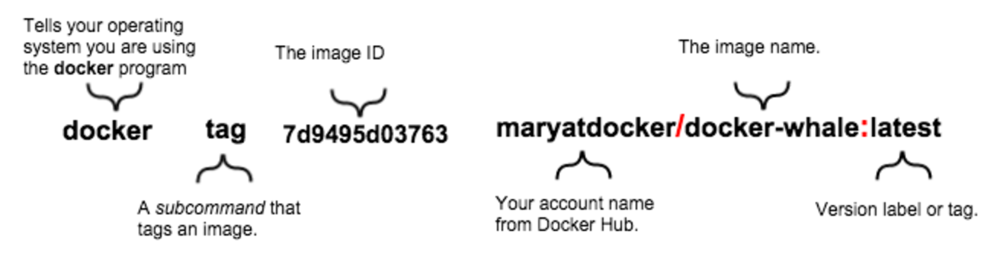

# See what images you currently have

```
docker images
```

# Add a docker tag

```
docker tag <image ID>  <docker hub username>/<image name>:<version label or tag>
```


# Give terminal your docker hub credentials

Create a docker hub account, if necessary

```
docker login
```

# Push your image

```
docker push <docker hub username>/<image name>
```

# Look at your docker hub account

Your image should be there.

# See images on your machine

```
docker images
```

# Remove all "docker-whale" images

```
docker rmi -f <image ID or image name>
```

-f is "with force"

# See docker help

```
docker --help
docker <COMMAND> --help
docker rmi --help
```

# Pull from your repo

## run it this way if it's our go web app from previous step
```
docker run -d -p 80:80 <yourusername>/<app-name>
```

## for some other image you might use this
```
docker run <yourusername>/<app-name>
```

# Stop your container from running
```
docker ps
docker stop <container id>
docker ps
docker images
```
